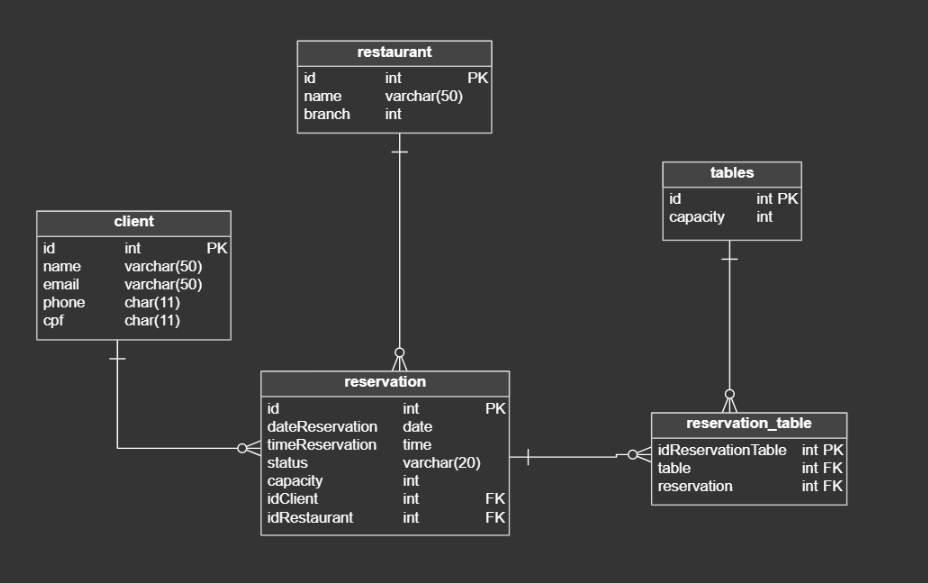

# Restaurante Reserva API

Este é um projeto desenvolvido em Spring Boot com o objetivo de gerenciar reservas de restaurantes. O projeto se inspira na funcionalidade de reservas de restaurantes do Google Maps, proporcionando uma experiência completa de reserva e envio de notificações por e-mail sobre o status das reservas.

## Sumário
- [Introdução](#introdução)
- [Entidades do Projeto](#entidades-do-projeto)
- [Funcionalidades](#funcionalidades)
- [Tecnologias Utilizadas](#tecnologias-utilizadas)
- [Configuração do Projeto](#configuração-do-projeto)

## Introdução
Este projeto visa criar um sistema de reservas de restaurantes que permite aos clientes fazer reservas em restaurantes, visualizar o status de suas reservas e receber notificações por e-mail sobre o andamento das mesmas.

## Entidades do Projeto
O projeto é modelado com as seguintes entidades:

- **Client**: Representa um cliente que faz uma reserva.
- **Restaurant**: Representa um restaurante onde as reservas podem ser feitas.
- **Reservation**: Representa uma reserva feita por um cliente em um restaurante.
- **Table**: Representa uma mesa no restaurante.
- **Reservation Table**: Representa a associação entre uma reserva e uma mesa específica no restaurante.

## Funcionalidades
- Cadastro de clientes.
- Cadastro de restaurantes.
- Cadastro de mesas nos restaurantes.
- Realização de reservas em restaurantes.
- Envio de notificações por e-mail sobre o status das reservas.
- Cancelamento de reservas com a remoção automática das mesmas.

## Tecnologias Utilizadas
- Java 17
- Spring Boot 3.3.2
- Spring Data JPA
- Hibernate
- Simple Java Mail
- PostgresSQL
- Flyway
- Maven

## Configuração do Projeto
### Pré-requisitos
- Java 17 ou superior
- Maven